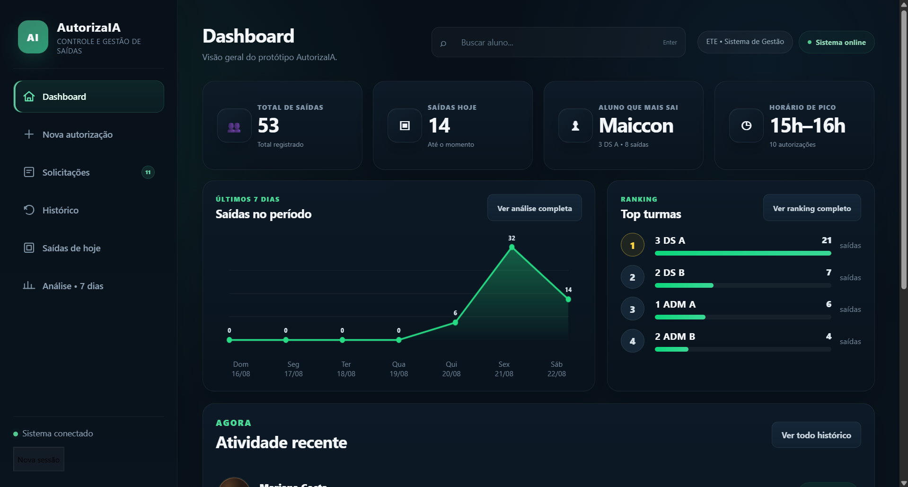
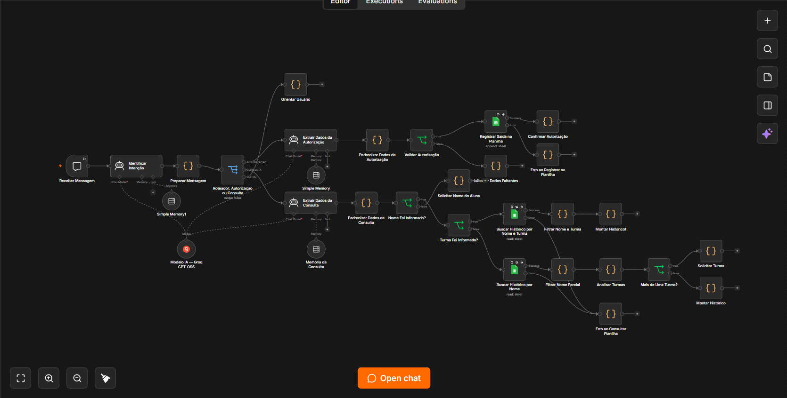
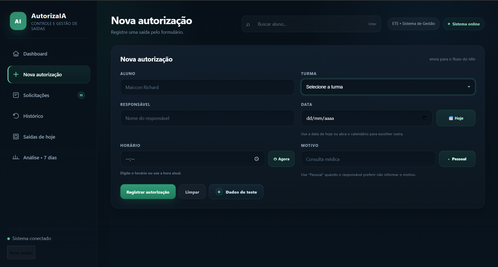
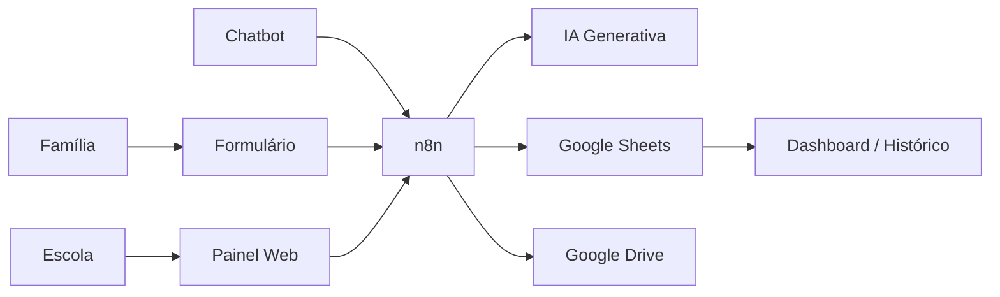
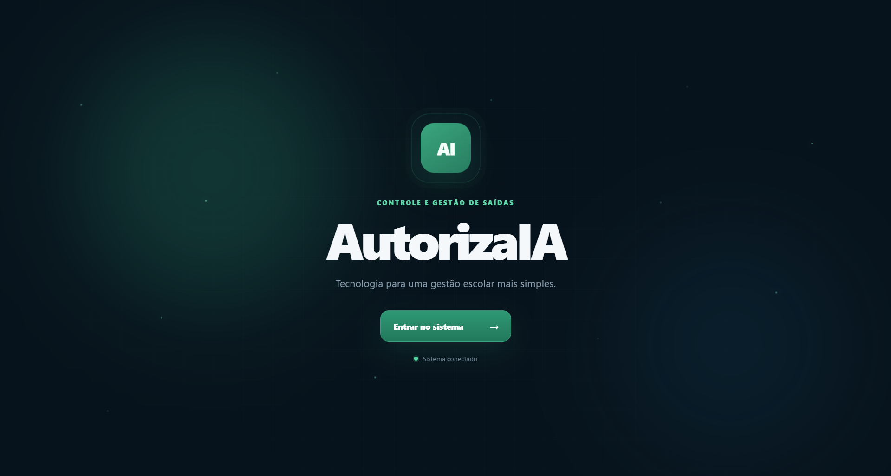
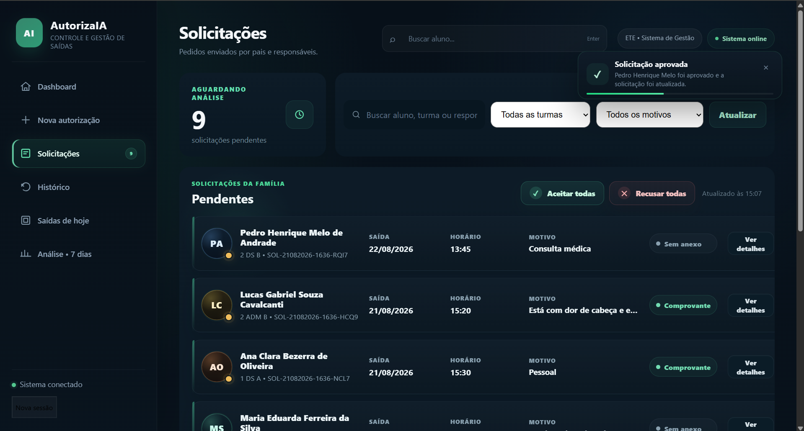

# AutorizaIA

> **IA e automação para tornar o controle de saídas escolares mais organizado, rastreável e ágil.**

AutorizaIA é um projeto acadêmico que combina **n8n, IA Generativa, Google Sheets, Google Drive e uma interface web** para digitalizar o processo de autorização de saída de estudantes.

<p align="center">
  
</p>

## Problema

Processos de autorização feitos por papel ou mensagens dispersas podem gerar dificuldade para localizar registros, conferir histórico, acompanhar horários e manter uma visão organizada das saídas.

## Solução

O AutorizaIA centraliza o processo em uma plataforma com:

- registro de novas autorizações;
- solicitações enviadas pela família;
- aprovação e recusa pela escola;
- comprovantes opcionais no Google Drive;
- histórico de saídas;
- painel de saídas do dia;
- dashboard e análise dos últimos 7 dias;
- chatbot com IA para registrar e consultar informações em linguagem natural.

## Destaques técnicos

### Chatbot n8n

O workflow principal possui múltiplas rotas e usa IA para:

- identificar a intenção (`AUTORIZACAO`, `CONSULTA` ou `OUTRO`);
- extrair dados estruturados de mensagens naturais;
- manter contexto com memória;
- continuar autorizações preenchidas em etapas.

A camada de código valida turma, data, horário e status antes do registro. O chatbot também trata consultas ambíguas, por exemplo quando existem alunos com nomes semelhantes ou o mesmo aluno aparece em mais de uma turma.

<p align="center">
  
</p>

### Plataforma web

<p align="center">
  
</p>

A interface foi construída em HTML, CSS e JavaScript e se comunica com workflows especializados do n8n por webhooks.

## Arquitetura



Mais detalhes: [`docs/ARQUITETURA.md`](docs/ARQUITETURA.md).

## Estrutura do repositório

```text
AutorizaIA/
├── frontend/
│   ├── index.html
│   ├── familia.html
│   └── CONFIGURE_AQUI.md
├── workflows/
│   ├── chatbot/
│   └── site/
├── data/
│   ├── sample-autorizacoes.csv
│   ├── sample-solicitacoes.csv
│   └── README.md
├── docs/
│   ├── screenshots/
│   ├── ARQUITETURA.md
│   ├── PORTFOLIO.md
├── examples/
│   └── prompts-teste.txt
├── README.md
├── SETUP.md
└── SECURITY.md
```

## Workflows incluídos

### Chatbot

- `AutorizaIA-Chatbot.json`

### Site

1. Registrar Autorização
2. Solicitações Família
3. Consultar Solicitações
4. Decidir Solicitação
5. Dashboard
6. Saídas de Hoje
7. Consultar Histórico

## Como executar

Veja o guia completo em [`SETUP.md`](SETUP.md).

> A versão pública usa placeholders para URLs e IDs. Isso é intencional para não publicar detalhes da infraestrutura original.

## Screenshots

### Tela inicial



### Solicitações da família



## Materiais do projeto

A entrega acadêmica original também inclui documentação em PDF, podcast com ElevenLabs e comerciais produzidos com D-ID e Flow. Por questões de tamanho, privacidade e organização, esses arquivos não fazem parte do código público. Consulte [`docs/PORTFOLIO.md`](docs/PORTFOLIO.md).

## Privacidade

A versão pública **não contém a planilha original, credenciais, IDs privados do Google ou o endereço real do n8n**. Os dados em `data/` são fictícios. Leia [`SECURITY.md`](SECURITY.md).

## Autor

**Maiccon Richard**  
Projeto Integrador — IA e Automação para Resolver Problemas Reais, 2026.

---

Este repositório representa um protótipo acadêmico e não deve ser utilizado em produção sem autenticação, controle de acesso, revisão de privacidade e proteção adequada dos webhooks.
