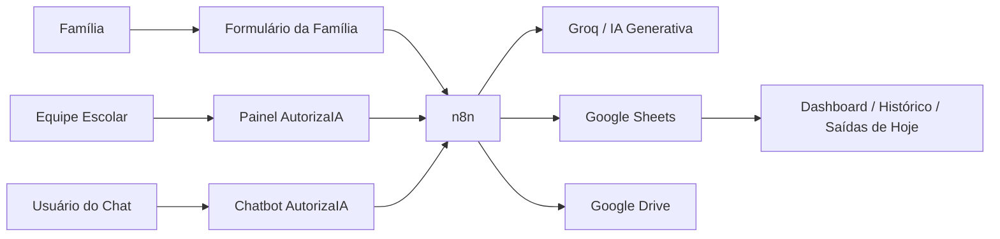

# Arquitetura do AutorizaIA

## Componentes

- **Frontend:** painel da escola e formulário da família em HTML/CSS/JavaScript.
- **n8n:** orquestração dos fluxos e regras de negócio.
- **IA Generativa:** classificação de intenção e extração estruturada de dados no chatbot.
- **Google Sheets:** persistência dos registros de saída e solicitações.
- **Google Drive:** armazenamento opcional de comprovantes.

## Princípio de segurança do chatbot

A IA interpreta a linguagem natural, mas as regras determinísticas em JavaScript validam turma, data, horário e status antes de concluir o registro.
